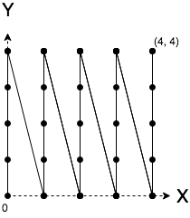
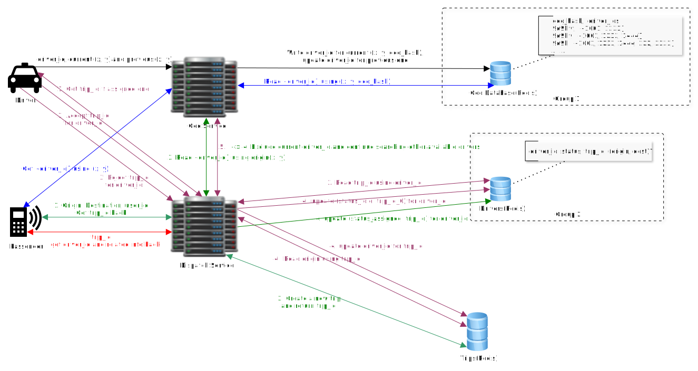

# Location-based service

## Scenario
### Use cases
* First stage
  * Driver reports locations(like sending heartbeats). The server cannot send requests asking for driver's location as it doesn't know them without drivers reporting to them. Usually driver(or more specifically, the app installed on the driver's phone) reports his location periodically. This is more efficient than letting serve send request and get response back.
  * Passenger can see the drivers around him in real time on the map.
* Second stage
  * Passenger requests Uber, match a driver with passenger
  * Driver denies / accepts a request
  * Driver cancels a matched request 
  * Passenger cancels a request
  * Driver picks up a passenger and starts a trip
  * Driver drops off a passenger and ends a trip
* Third stage
  * Uber Pool
  * Uber Eat

### Estimation
* The server cannot send requests asking for driver's location as it doesn't know them without drivers reporting to them. Usually driver(or more specifically, the app installed on the driver's phone) reports his location periodically. This is more efficient than letting server send request and get response back. Also the latter do not save any bandwidth or CPU.
* Assuming 200K are online at the same time, and each driver reports his location every 4 sec.  
  Driver QPS = 200K / 4 = 50K  
  Peak QPS = 50K x 3 = 150K  
  Reporting locations is where writes mainly come from, so write QPS is 150K.
* Passenger doesn't have to report his location. And it must be much smaller than Driver QPS. Assuming daily passenger number is similar to the driver's, and each client app updates the drivers' locations every 4 sec, the read QPS is then similar to write QPS -- 150K.
* Storage. (may not need to estimate the number first)  
  If we store all the locations: 200K * 86400 / 4 * 100bytes(length of each record)~ 0.5 T / day.
  If we just store the current locations: 200K * 100bytes = 20MB. 

## High level design
### Service
* Geo Service. 
* Dispatch Service.

### Storage
* Locations table.
(driver_id, latitude, longitude, last_updated_time, is_current)
* Trips table.
(trip_id, origin, destination, driver_id(along with denormalized info like car license number, photo_id), passenger_id, creation_date, start_date, end_date, is_deleted, price)
* Drivers table.
(driver_id, status, trip_id(may add denormalized columns like origin and destination), last_updated_time)

## Detailed design
* How to get the locations of nearby drivers?  
  * SQL query.
    ```sql
    SELECT * FROM Location 
    WHERE lat < myLat + delta
      AND lat > myLat - delta
      AND lng < myLng + delta
      AND lng > myLng - delta;
    ```
    This is too slow -- run time is linear to the number of records.
  * Spatial indexing. To speed the location query up, we can try indexing the locations in the DB, which essentially maintaining a B tree containing the sorted data in its leaves and linking them together. If we use the default index of multi-value fields, i.e., (x1, y1) < (x2, y2) <=> (x1 < x2) || ((x1 == x2) && (y1 < y2)). This comparator is valid, but using it would return locations of same x coordinate for the location queries, neglecting too many useful results. This indexing can be visualized by following diagram. Image a 1D zigzag line from (0, 0) to (4, 4) crossing all the 2D points. The closer to the origin the 2D point is on the zigzag line, the smaller it is after the default indexing.
  
  There are two other ways of indexing the coordinates that works great for our use, both of which map the 2D cooridinates to a 1D value using some special algorithms. 
    - Google S2. Used by Uber. More precise and has richer APIs compared to the other.
      + It first partition the sphere space into 2D grid. The size of cell can be specified. 
      + Use Hilbert Curve to map the 2D locations to 1D value(2^64 integer). E.g. (-30.043800, -51.140220) -> 10743750136202470315. The precision depends on the size of cell. Theoritically, 2^64 is enough to represent each cell even if dividing the totol area on earch such that each cell is 1 cm^2.
      + If two points are close in Hibert Curve value, they must be also close in the 2D grid. However the opposite is NOT necessarily true since there are points that are close in the 2D grid not having close HC values. But they are the minority.
      + Refs: 
        * Google S2: http://blog.christianperone.com/2015/08/googles-s2-geometry-on-the-sphere-cells-and-hilbert-curve/
        * Hilbert Curve: http://datagenetics.com/blog/march22013/index.html, http://bit-player.org/extras/hilbert/hilbert-mapping.html
    - Geohash. Simpler but less precise compared to the first one.
      + Based on the idea of binary-search. To get the 1D value, we keep dividing the 2D space into two parts, using horizontal line and vertical line alternatively. Mark 0 if the point is on the left/lower part, otherwise 1. Do it n times, and the result is a n-bit number.
      + Why horizontal and vertical are done alternatively? Because this can ensure that the hash code of two locations can have similar distance(length of common prefix) if the two locations change. Say two locations are lined up vertically, and another two are lined up horizontally. The hash code distance should end up almost the same, which cannot be achieved if we put all latitude digits first and then longitude digits.
      + The above method actually converts a 2D coordinates into 1D value on the Peano curve. Close points on the curve TYPICALLY BUT NOT NECESSARILY close in the 2D plane, which is the main difference from Hilbert curve. The reason for the sudden change can be easily seen from the Peano curve graph. Or think about two geo hashs: 0111, 1000. They differ only by 1, but the actual location they represent are far away from each other. Therefore when using this method, the actual distance should also be calculated.
      + The binary number is usually converted into a base-32 string. For Geohash, 6 letters has the max error of 0.6km, which is usually enough.
  * How to store the geo data?
    - SQL is not good, no matter we use 64-bit number directly or convert it into base-32 string. We have to index on the geo hash value, and updating the index tree is costly.
    - NoSQL - Cassandra is not good either for the same reason.
    - NoSQL - MemCached. Not good since it doesn't persist data. Also it dosn't support Set data structure directly(?).
    - NoSQL - Redis. Use the string representation of geo hash value(geohash/Google S2) as the key, the value is the (hash) set of drivers with that location. We want to store the map hierachically. Say the geo hash value is 9q9hvt, we store three keys: 9q9hvt, 9q9hv, 9q9h. When the user want to get the nearby drivers, he sends his coordinates and its geo hash value, first return the drivers corresponding to the 6-digit geohash, if nothing, find the drivers with 5-digit geohash, until 3-digit one. To update, driver sends his current and previous location to the service, which will update the map in Redis accordingly.
* 
  * In the above diagram, black and blue arrows represent the workflow for the first stage. 
  * The green arrows show the workflow for handling passenger's trip request. Note that the passenger's location and origin's location may differ greatly. So the nearby drivers' locations should center on the origin's location rather than the passenger's. This request will be handled by dispatch service, which creates a new trip and assign an available driver immediately. If the driver accepts it, trip table will be updated with the driver's brief info, and since the passenger keeps asking the server for response(red arrow), he should be notified very soon with the driver's info.
  * The dark purple arrows represent the workflow of driver's interaction with dispatch service. He keeps asking the server for new trip when idle, or asking to see if the trip is canceled when confirmed a trip. There are just two status here: idle and assigned. If the driver accepts the trip, the trip table will be updated with his brief info. Otherwise, drivers table will be updated with idle status, and a new round of searching for available drivers will be started with trip info.
  * After the driver picks up the passenger, he clicks on "start trip" which sends request to the server that modifies the start_date for the corresponding trip. After dropping the passenger off, he clicks on "end trip" which sends request to the server that modifies the end_date for that trip. Also marking the driver "idle" in the drivers table. This is not drawn in the diagram yet. 
  * If the passenger rejects the trip after seeing the confirmation, it will send a request to the server with pr_id, trip_id and corresponding data in the trips table and drivers table will be updated. This is not drawn in the diagram yet.