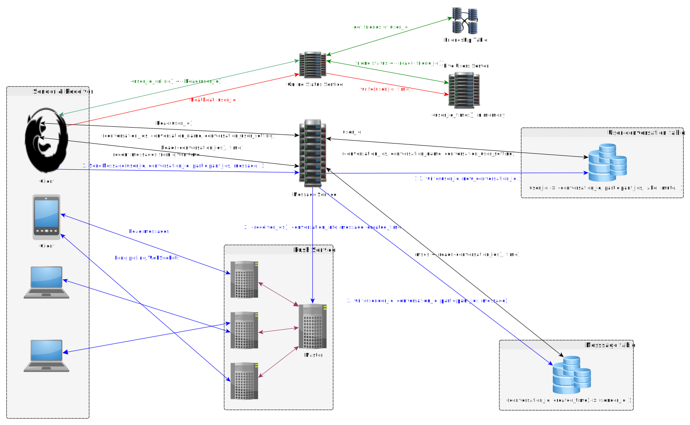

# Messenger
## Scenario
### Core use cases
* One to one chatting
* Group chatting
* User online status

### Common use cases
* History info
* Log in from multiple devices
* Friendship / Contact book

### Estimation
* Requests sent from the client(analyzed from the use cases)
	1. (conversation_ids, conversation_name, conversation_user_setting) <- Read(user_id)
	2. (latest_n_msgs(msg, timestamp, sender_id)) <- Read (conversation_id, time_now)
	3. Write (sender_id, conversation_id, msg, timestamp, new_conversation_info)
	4. (conversation_info) <- Read (user_id, conversation_id)
	5. Write (conversation_info, user_id, conversation_id)
* DAU: 100M 
* QPS: Suppose a user posts 20 messages / day
	- Average Write QPS = 100M * 20 / 86400 ~ 20k
	- Peak Write QPS = 20k * 5 = 100k
	- If we send 1, 2 perodically -- every 1s, then the read QPS the system needs to support is 100M QPS -- too high and need to use a better way.
* Storage: Suppose A user sends 20 messages / day
	- 100M * 20 * 30 Bytes = 30G new data each day.

## Service
### Message service

## Storage
### Message table
* NoSQL database
	- Large amounts of data
	- No modification required
* Schema

	| Columns      | Type      |                  | 
	|-----------   |-----------|------------------| 
	| message_id   | integer   | sender_id+timestamp. Primary key    | 
	| conversation_id    | integer   | the conversation it belongs. Foreign key  | 
	| sender_id    | integer   |                  									 | 
	| content   	 | text      |                  									 | 
	| created_time | timestamp |                  									 |	

	* For message_id, the timestamp has the granularity of second, since two messages cannot be sent out by same user within 1 sec. We can use 64bits integer to store the composite id, where first 32bits storing the timestamp and the rest storing the sender_id. If we use epoch time starting from today, then for the next 100years, the time is 86400s/day x 365 x 100 = 3B, smaller than the largest number that can be represented by 32bits(4B, remember this!). The rest of bits can store as many as 4 billion people, which can be more if we use larger data type or reduce the space left for the timestamp.
	A better way might be remove the message_id and use (conversation_id, created_time) as the primary key. Most of the NoSQL databases allow composite primary keys(https://aws.amazon.com/blogs/database/choosing-the-right-dynamodb-partition-key/). 

### User-conversation table
* SQL database
	- One machine is probably enough. Assuming 8 billion people on earth all use this system. The size of this table = 8 x 10^9 x 10 x 30 = 2TB. 
  - Need to support multiple indices
  - Build the following indices:
    + user_id(+updated_time): Search all conversations the user participates, and order by updated time. Since there are usually not many conversations for each user, it is okay to query on user_id only and then sort the result in memory.
    + user_id + conversation id: Get all detailed info about a conversation (e.g. label, participants, and user-related info like mute or not).
    + participants_hash: Find whether a certain group of persons already has a chat group. This is used to prevent from creating another group with same participants, but I think it should be allowed, so this column can be removed.
* Schema

	| Columns          | Type      |                          | 
	|------------------|-----------|--------------------------| 
	| user_id           | integer   | id of a participant in the conversation| 
	| conversation_id         | integer   | creater_id + created_time | 
	| participants_ids   | text      | json                     | 
	| participants_hash | string    | avoid duplicates conversations | 
	| created_time        | timestamp |                          | 
	| updated_time        | timestamp | index=true               | 
	| label            | string    |                          | 
	| mute             | boolean   |                          | 

	- Primary key is user_id + conversation_id
		+ Why not use UUID as primary key? Need sharding. Not possible to maintain a global ID across different machines. Use UUID, really low efficiency.
	- If a conversation has n participants, when a new conversation is created, n rows must be inserted to conversation table with their corresponding user ids. The shared information can be stored in a separate table, but that would make getting full information of a conversation slower since it requires two queries. 
	- conversation_id can be stored using 64-bits integer(creater_id + created_time), same ways as the message_id.
* Use cases:
	- Get client user's conversations and info for each conversation, like participants and user-related settings. This request is sent only when first use of the app, or when click on a certain conversation. 
	- Unsubscribe a certain conversation/group. Need to modify the participants info for all the records with the same conversation id, so it's slow, but since this operation doesn't happen often and some delay is acceptable, it's fine. As long as the records with (current_user_id, conversation_id) are deleted, the server response OK to the client and client can also delete that conversation id from local storage. In this way, even if very soon some other participants in that group send any message, it might still be pushed to the user but he won't see it.

### Initial solution
* Sender sends message and message receiverId to server
* Server creates a conversation for each receiver and sender
* Server creates a new message (with conversation_id)
* How does user receives information
	- Pull server every 10 second

## Scale
### Sharding
* User-conversation table
	- Shard by user_id. There shouldn't be write hot spot since users typically not creating new groups freqently(unless it is a bot). And users typically give even read to this table.
	- Cache result with user_id as key.
* Message table
	- Shard by conversation_id. Primary key has to be(conversation_id, created_time) since it can uniquely identify each message. Note that although there could be some conversations are very active at some time, it wont' cause much writes to the servers, as there is ususaly at most one message per second. Using consistent hashing, the hot conservations should be evenly distributed. So using conversation_id as shard key should be okay. 
	- Index the primary key on each machine to support fast range query.
	- Cache messages: conversation_id -> {messages}  

### Speed up with Push service
Even with pre-generated user-message table like the one in Twitter design, it is still slow as the latency includes push time and polling period. 

#### Socket
* HTTP vs Socket
	- HTTP: Only client can ask server for data
	- Socket: Server could push data to client
* What if user A does not connect to server
	- Relies on Android GCM(Google Cloud Messaging)/IOS APNS(Apple Push Notification Service). They are two public services for sending push notifications, which stores the message queue for each user(sent from the app server) and push the messages to them when they are online. The client can be mobile app or some browsers. We can also implement our push service like below.

#### Push service
##### Initialization and termination
* When a user opens the app, the user connects to one of the socket in Push Service
* If a user is inactive for a long period, drops the connection. 

##### Number of push servers
* Assuming 100M DAU, and 5M concurrent connections for each server(according to the theory of C10M, this is already possible), the total number of servers is 20. 

##### Steps
1. User A opens the App, it asks message service for the address of push server.
2. User A uses the ip of push server to connect with it and stays in touch with it by socket. 
3. User B sends msg to User A. msg is first sent to the message server.
4. Message service sends the msg to the push service(master). Once the push service receives the msg, it can send ack to the webserver to finish the request processing.
5. Push service master send the msgs to the push servers responsible for the specified users(fan-out).
6. The push server push the msg to User A if he is connected. Otherwise store the msg in the message queue for A.

### Channel service
* In case of large group chatting
	- If there are 500 people in a group, message service needs to send the message to 500 push servers. If most of receivers within push service are not connected, it means huge waste of resources. 
* Add a channel service
	- Each conversation should have an additional field called channel. Channel service knows which users are online/offline. For big groups, online users need to first subscribe to corresponding channels. 
		+ When users become online, message service finds the users' associated channel and notify channel service to subscribe. When users become offline, push service knows that the user is offline and will notify channel service to unsubscribe. 
	- Channel service stores all info inside memory. 

### How to check / update online status
#### Online status pull
* When users become online, send a heartbeat msg to the server every 3-5 seconds. 
* The server sends its online status to friends every 3-5 seconds. 
* If after 1 min, the server does not receive the heartbeat msg, considers the user is already offline. 

#### Online status push
* Wasteful because most users are not online

### Detailed design
* 
* With push service dominating the message delivery, reads should not go to the message table very frequently. But it is still good to pull once in the background when the user first login. The app should store messages per conversation locally in some read-only files. The app maintains last pull time and only pull when the user scrolls to a page when there is no corresponding local messages. When the user deletes a local message through the app, the system can send a request to delete the message stored in the DB too. The user should be forbidden to delete local message files.
* This design doesn't use channel service since the message should be sent to the push server no matter the user is connected or not. If not, the message will be queued and pushed once he is connected again.
* If the message is sent to a new user/group, then conversation_id is null and webserver creates the conversation_id and then store the data into user-conversation table(Step 1.1).
* During push from message server to push service master, the created time is generated on the webserver to keep the order of messages in the same conversation. Some says there should be a sequence id here, why?
* It might be okay not to log message data at all and ask the client to store them on their devices, which is what Whatsapp does.
* Facebook uses HBase to store messages. (trade-offs?)