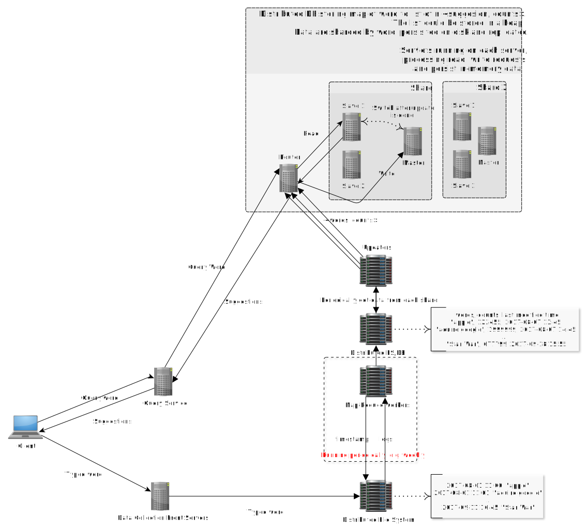

# Typeahead

## Scenario
* Google suggestion
	- Prefix -> top n hot key words(in x years)
	- DAU: 500M
	- Search: 6 * 6 * 500M = 18B (Each user searchs for 6 words everyday, each word has 6 characters)
	- QPS = 18b / 86400 ~ 200k
	- Peak QPS = QPS * 2 ~ 400k
	- Storage: Suppose 1 new word per person each day, then there are 500M new words each day. Assuming 6 characters per word on average, then the storage that is needed is 6 * 2 * 500M = 6GB per day. Assuming we store data for the last 10 years, then the total size would be: 6GB * 10 * 365 ~= 22TB. This time length may be shortened, depending on the actual requirement.
* Twitter typeahead

## Initial design
* Query service
	- Each time a user types a character, the entire prefix is sent to query service.
* Data collection service

## Storage
### Query service DB
#### Word count table
* How to query on the db
* Query SQL: Select * from hit_stats where keyword like ${key}% order by hitCount DESC Limit 10
	- Like operation is expensive. It is a range query. 
	- where keyword like 'abc%' is equivalent to where keyword >= 'abc' AND keyword < 'abd'

| keyword | hitCount | 
|---------|----------| 
| Amazon  | 20b      | 
| Apple   | 15b      | 
| Adidas  | 7b       | 
| Airbnb  | 3b       | 

#### Prefix table
* Convert the word count table to a prefix table, stored in databases and their caches. 

| prefix | keywords                     | 
|--------|------------------------------| 
| a      | "amazon","apple"             | 
| am     | "amazon","amc"               | 
| ad     | "adidas","adobe"             | 
| don    | "don't have", "donald trump" | 

Scan the word count table and for each word, check each prefix, and add the word to the set corresponding to each prefix. This process doesn't have to be very fast since it is offline, done by the data collection service periodically. But how to update this table?
I think we might be able to store this prefix table in Redis, so accessing it would be fast and it can persist data. The key is the prefix, and the value could be a min-heap that stores k most popular words with that prefix, and their associated frequencies. Suppose we have a new frequency for "amazon", then check each of its prefixes and see if it already exists in the heap. If so, update the location of "amazon" in the heap, otherwise compare the new frequency with the top element in the heap and insert it if it is larger(remove the top element at the same time). Does it make sense?

### Trie
* Trie ( in memory ) + Serialized Trie ( on disk ). 
	- Trie is must faster than DB because
		+ All in-memory vs DB cache miss

* Store word count at node, but it's slow
	- e.g. TopK. Always need to traverse the entire trie. Exponential complexity, since to get the n most popular words with a certain prefix, all of the nodes under that prefix in the trie need to be traversed.
* Instead, we can store the top n hot key words and their frequencies at each node, search becomes O(len).

| prefix | keywords                     | 
|--------|------------------------------| 
| a      | "amazon","apple"             | 
| am     | "amazon","amc"               | 
| ad     | "adidas","adobe"             | 
| don    | "don't have", "donald trump" | 

* How do we add a new record {abd: 3b} to the trie
	- Insert the record into all nodes along its path in the trie.
	- If a node along the path is already full, then need to loop through all records inside the node and compared with the node to be inserted. We could store the words and their frequencies in a heap like the first approach.

### Data collections service
* How frequently do you aggregate data(more specifically, the log data that records each search word with its timestamp)
	- Real-time not impractical. Read QPS 200K + Write QPS 200K. Will slow down query service.
	- Once per week. Each week data collection service will fetch all the data within the most recent one week and aggregate them. 
* How does data collection service update query service? Offline update and works online.
	- All in-memory trie must have already been serialized(for backup in case the server is down). Read QPS already really high. Do not write to in-memory trie directly.
	- Use another machine. Data collection service updates query service.  Memory has a limit on the rate at which data can be read from or stored into a semiconductor memory by a CPU(a.k.a. memory bandwidth).If we update the trie while we are using it, the read operations will be affected as some operations have to wait due to the limited bandwidth(or because of concurrent access to the common data structure). However I think the CPU is more likely to be the bottleneck than the memory bandwidth, since the update must take quite a lot of CPU cycles. 
	http://www.nic.uoregon.edu/~khuck/ts/acumem-report/manual_html/ch_intro_bw.html  
	That's why we should do the update on another machine --- data collectio service will aggregate the data into word counts table, copy the deserialized data from the other machine, deserialize the trie from the disk, and update the trie using the data in the word counts table. After it is done, we can have a scheduler at the front of the servers and forward the traffic to the other machine with up-to-date trie. The old machine will be used for update instead. The switch is done by atomically updating the routing map in the scheduler -- create a copy of new routing map file with new routing info first, and then atomically move the file to the old file location and thus replace it. This can be done often very fast and should have little impact on the request handling.  
	Instead of updating the existing trie, why not just create a new trie from the word counts table? -- I think it would be more expensive.
	How does the server read data from the very large word counts table? --- We could use several servers do this job in parallel.

## Scale
### How to reduce response time
* Cache result
	- Front-end browser cache the results. Or maybe along with words searched by the user. In the format of map of prefixes and word list. Set an expiration time on it. So either when cache expires or the user closes the browser, the cache will be invalidated.
* Pre-fetch ?
	- Fetch the latest 1000 results starting with the input prefix. Say when you enter "a", 1000 strings starting with "a" will be fetched and the top 5 starting with "am" may very likely be in those strings.

### What if the trie is too large for one machine
* Use consistent hashing to decide which machine a particular string belongs to. 
	- A record can exist only in one machine. Sharding according to the first char will not distribute the resource evenly. Instead, calculate consistent hashing code 
	- a, am, ama, amax stored in different machines. But the value corresponding to a certain prefix still stores k most popular words starting with that prefix. So after entering "amazon", it will be added to the values corresponding to "a", "am", "amaz", "amazo", "amazon" respectively, on different machines.

### How to reduce the size of log file
* Probablistic logging. 
	- Too slow to calculate and too large amount of data to store. 
	- Log with 1/10,000 probability
		+ Say over the past two weeks "amazon" was searched 1 billion times, with 1/1000 probability we will only log 1 million times. 
		+ For a term that's searched 1000 times, we might end up logging only once or even zero times. 

## Final Design
It might be easier and more flexible to use HashMap as the in-memory data structure instead of trie. Sometimes the typed words may not necessarily be the prefix of the suggestions.
https://www.facebook.com/Engineering/videos/432864835468/
https://blog.evernote.com/tech/2013/05/21/an-inside-look-at-type-ahead-search-in-evernote/
https://www.jiuzhang.com/qa/1947/

## Questions
* How to include the recent popular words that have not showed up more than previous popular words?  
  Maybe multiply the actual counts by a weight and the compare it with the weighted counts in the trie?